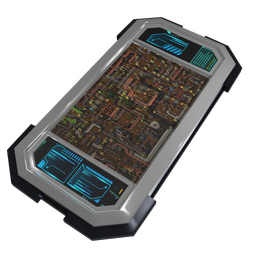

#### Factorio-Mod
# Datapad
---

  
  

    
    
    
    

Store your thoughts and plans within this portable device.

This mod adds a new new item `datapad` to the game, it stores texts as notes.
Not just another notepad, but a text storage item that can be shared with others!

### Features

- Factorio rich-text support

### Screenshots

### Enjoying this?
Just star the repo or make a donation.

Your help is valuable since this is a hobby project for all of us: we do development during out-of-office hours.

### Contribution
Pull requests are very welcome.